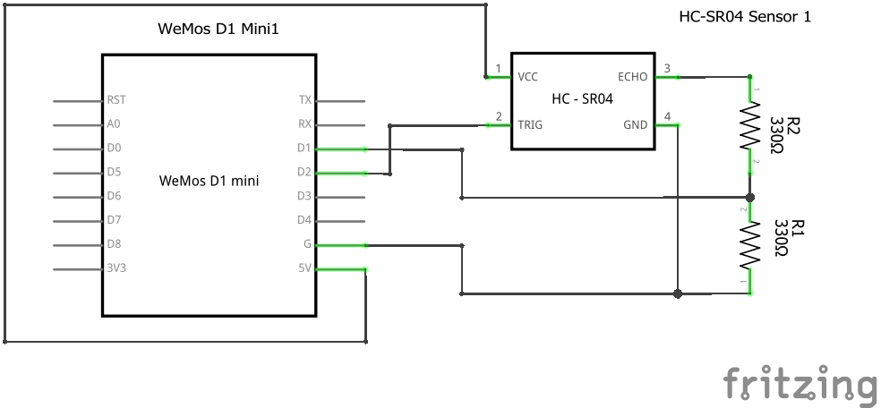
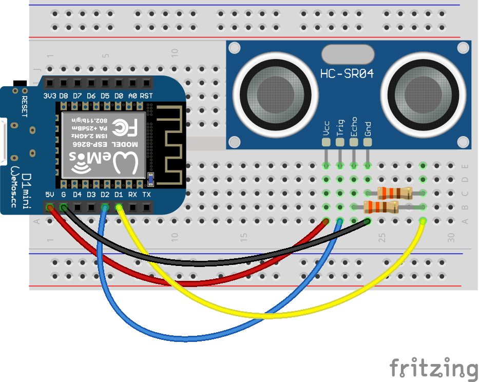

# HC-SR04 Ultrasonic Distance Sensor

Code for getting started with a HC-SR04 Ultrasonic distance sensor and an ESP based development board (like Wemos D1 mini).

[TODO description of how sensor works]

 

## Files and Folders

| File/Folder | Description |
|--- | --- |
| micropython/ | Scripts written in micropython for measuring distance. |
|  |  |

 

## Branches

**master**: main branch. currently not using other branches.

 

## Circuit Diagram
Wire the components as shown in the diagram.

#### Components Needed
* HC-SR04 Ultrasonic sensor
* 330 ohm resister x2
* connecting wires
* ESP development board (e.g. Wemos D1 mini)

 

 

### Default Pin Wiring

| Pin No. | Function | Device Connection |
| --- | --- | --- |
| 5V | 5V | HC-SR04 VCC 5V |
| D2 | GPIO 4 (SDA) | HC-SR04 Trig |
| D1 | GPIO 5 (SCL) | HC-SR04 Echo |
| G | GND | GND |

 

## References

* Micropython library: https://github.com/rsc1975/micropython-hcsr04
